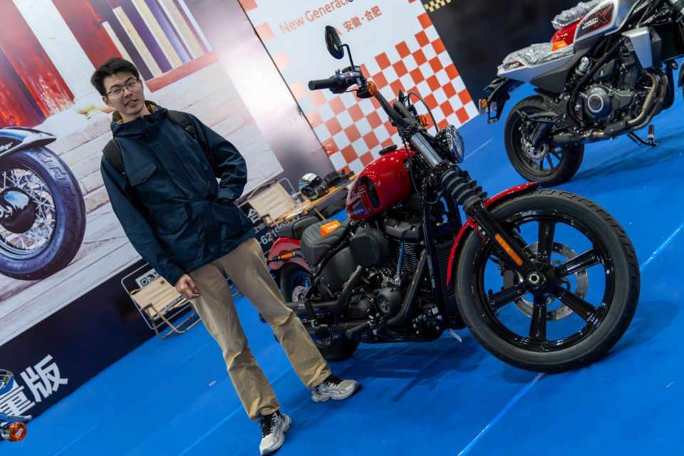
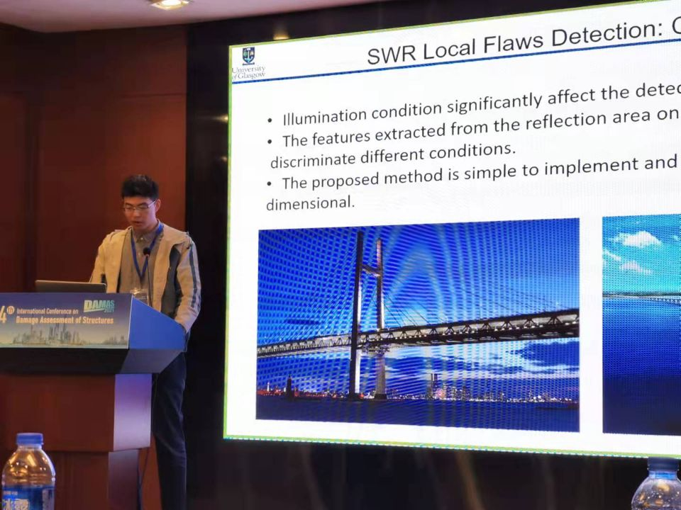

# 👨‍🎓About

**Feiyang Pan** is a 2nd-year Graduate student in the School of Engineering Science, University of Science and Technology of China. His research interests include fault diagnosis, nondestructive testing by using advanced signal processing and data-mining methods. 

Please find his CV [here](../files/cv.pdf "Feiyang Pan's CV"){:target="_blank"}. 

# 🎓Education 

- 09/2022 ~ Present: [Division of Precision Machine and Precision Instrument](https://pmpi.ustc.edu.cn/main.htm "PMPI, USTC"){:target="_blank"},  [University of Science and Technology of China](https://en.ustc.edu.cn "USTC"){:target="_blank"} 
    - Graduate Student in *Precision Machine and Precision Instrument*
- 09/2018 ~ 06/2022:  [Glasgow college](https://www.gla.uestc.edu.cn/english/Home.htm "Glasgow College，UESTC"){:target="_blank"},  [University of Electronic Science and Technology of China](https://en.uestc.edu.cn/ "UESTC"){:target="_blank"},  [University of Glasgow](https://www.gla.ac.uk/ "UoG"){:target="_blank"}
    - B.Sc. in *Electronic and Information Engineering* 
    - GPA: 3.87/4.0 (89.10/100.00), rank 20st/231 in the major 
- 09/2015 ~ 06/2018:  Wuhan No. 6 High School 

# 📃Publications

- **Pan, F**., Liu, Z., Ren, L., Yang, L., & Zuo, M. (2024) Ensemble fault detection based on magnetic flux leakage images with noise robustness for steel wire ropes. (under review)
- Ren, L., Liu, Z., **Pan, F**., Yang, L. (2024) Internal Broken Wire Inspection Equipment and Adaptive Detection Method Based on Magnetic Flux Leakage Imaging. (under review)
- **Pan, F**., Liu, Z., Ren, L., & Zuo, M. (2023). Adaptive local flaw detection based on magnetic flux leakage images with a noise distortion effect for steel wire ropes. IEEE Transactions on Industrial Electronics. (Impact factor = 7.7) [Link](https://ieeexplore.ieee.org/abstract/document/10122866 "IEEE TIE"){:target="_blank"}.
- **Pan, F.**, Huang, Y., Ren, L., & Liu, Z. (2023, October). Inspection of Wire Ropes Based on Magnetic Flux Leakage Images by Using YOLOv5. In 2023 Global Reliability and Prognostics and Health Management Conference (PHM-Hangzhou) (pp. 1-7). IEEE. [Link](https://ieeexplore.ieee.org/abstract/document/10482526 "IEEE PHM"){:target="_blank"}.
- **Pan, F.**, Ren, L., Zhou, J., & Liu, Z. (2022, March). Fault classification based on computer vision for steel wire ropes. In Journal of Physics: Conference Series (Vol. 2184, No. 1, p. 012035). IOP Publishing. [Link](https://iopscience.iop.org/article/10.1088/1742-6596/2184/1/012035/meta "IOP conf"){:target="_blank"}.

# 🏅Honors and Awards
- 06/2022:  Sichuan Province Outstanding Undergraduate Award (Top 3%)
- 06/2022:  UESTC Outstanding Undergraduate Award 
- 04/2021:  Mathematical Contest in Modeling (MCM)，Honorable Mention (Top 26%)
- 10/2020: China Undergraduate Mathematical Contest in Modeling (CUMCM)，First prize (Top 2%)

# 🔧Skills

- Programming: Matlab, Python, LaTeX 
- Software: Ansys Maxwell, K-Wave, Amira 
- Languages: (Mandarin) Chinese, English 

# 📷Gallery

    
    
    
     
    
    
    
    
 

---
