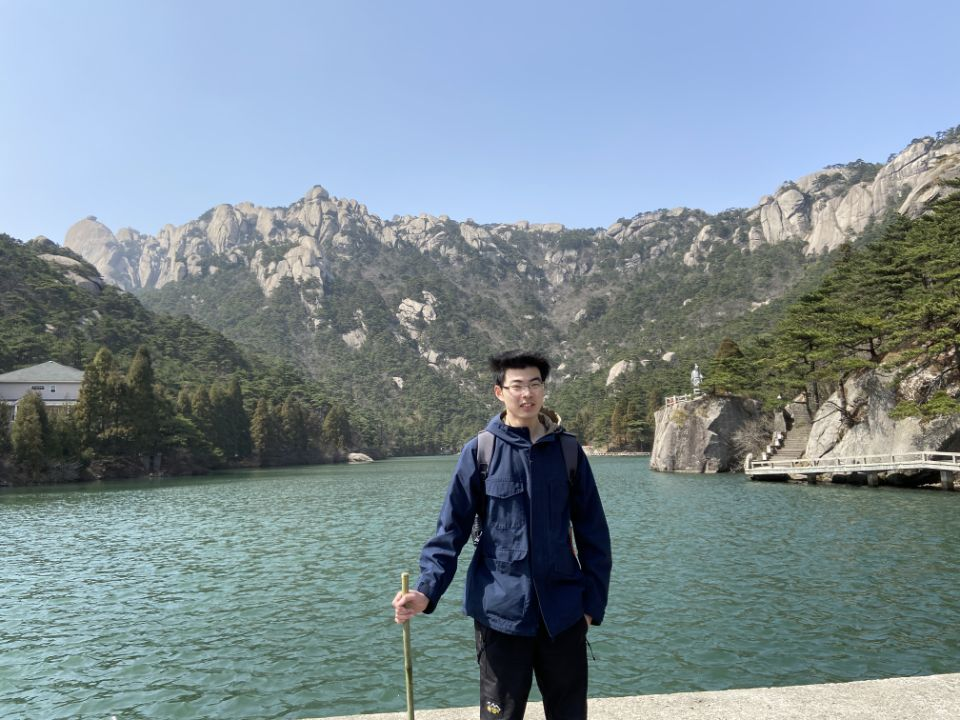
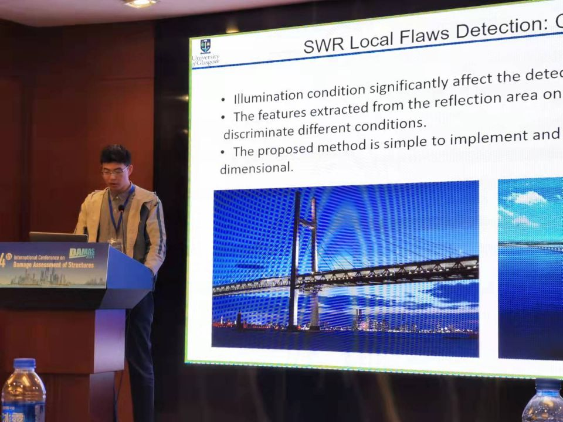
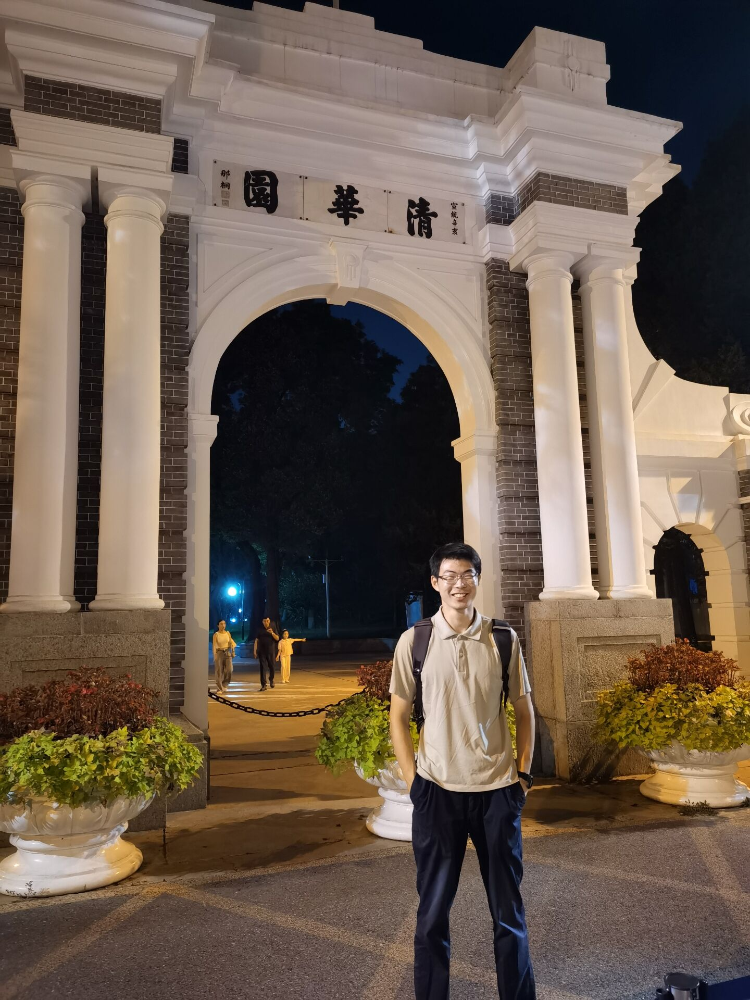

<!-- 中文个人主页 -->
<!--  -->
---

# 👨‍🎓个人简介

**潘斐扬**，男，中国湖北武汉人，现为香港理工大学机械工程系在读博士生。目前感兴趣的研究方向为故障诊断与设备健康监测中的算法设计。

[个人简历](../files/cv_cn.pdf "潘斐扬的简历"){:target="_blank"}. 

# 🎓教育经历 

- 2025年9月 ~ 至今：香港理工大学机械工程系
- 2022年9月 ~ 2025年6月: [工程科学学院](https://pmpi.ustc.edu.cn/main.htm "PMPI, USTC"){:target="_blank"},  [中国科学技术大学](https://en.ustc.edu.cn "USTC"){:target="_blank"} 
    - 精密机械与精密仪器系，学术型硕士研究生
    - GPA: 3.96/4.30 (91.7/100)，专业排名 6/132
- 2018年9月 ~ 2022年6月:  [格拉斯哥学院](https://www.gla.uestc.edu.cn/english/Home.htm "Glasgow College，UESTC"){:target="_blank"},  [电子科技大学](https://en.uestc.edu.cn/ "UESTC"){:target="_blank"},  [格拉斯哥大学](https://www.gla.ac.uk/ "UoG"){:target="_blank"}
    - 电子信息工程学士学位
    - GPA: 3.87/4.0 (89.10/100.00), 专业排名 20/231
- 2015年9月 ~ 2018年6月:  武汉六中 

# 📃成果

## 论文

- **Pan, F.**, Liu, Z.*, Ren, L., Yang, L., & Zuo, M. (2025). Ensemble fault detection based on magnetic flux leakage images with noise robustness for steel wire ropes. ISA transactions. (Impact factor 6.5)  [Link](https://www.sciencedirect.com/science/article/abs/pii/S001905782500271X){:target="_blank"}
- **Pan, F.**, Wei, X., Tian, C*. (2024) Impact of murine skull on transcranial photoacoustic imaging: a numerical study. Fifteenth International Conference on Information Optics and Photonics (CIOP 2024). SPIE. [Link]
- Liu, S., Zheng, X., **Pan, F.**, Wang, B., and Tian, C.* (2024) Adaptive edge-enhanced Markov Chain Monte Carlo method for sound speed reconstruction in ultrasound computed tomography. IEEE Transactions on Instrumentation and Measurement (Impact factor 5.6). [Link](https://ieeexplore.ieee.org/document/10648844 "IEEE TIM"){:target="_blank"}
- **Pan, F.**., Liu, Z., Ren, L., & Zuo, M. (2023). Adaptive local flaw detection based on magnetic flux leakage images with a noise distortion effect for steel wire ropes. IEEE Transactions on Industrial Electronics. (Impact factor = 7.7) [Link](https://ieeexplore.ieee.org/abstract/document/10122866 "IEEE TIE"){:target="_blank"}.
- **Pan, F.**, Huang, Y., Ren, L., & Liu, Z. (2023, October). Inspection of Wire Ropes Based on Magnetic Flux Leakage Images by Using YOLOv5. In 2023 Global Reliability and Prognostics and Health Management Conference (PHM-Hangzhou) (pp. 1-7). IEEE. [Link](https://ieeexplore.ieee.org/abstract/document/10482526 "IEEE PHM"){:target="_blank"}.
- **Pan, F.**, Ren, L., Zhou, J., & Liu, Z. (2022, March). Fault classification based on computer vision for steel wire ropes. In Journal of Physics: Conference Series (Vol. 2184, No. 1, p. 012035). IOP Publishing. [Link](https://iopscience.iop.org/article/10.1088/1742-6596/2184/1/012035/meta "IOP conf"){:target="_blank"}.

## 专利

 -  一种基于漏磁图像目标检测的钢丝绳缺陷辨识方法[P].      CN202311643447.6,    2024-02-06.  
 - 一种失真噪声下的钢丝绳漏磁图像缺陷检测方法[P].      CN202211315809.4,    2023-01-06.  
 - 一种基于漏磁图像纹理获取运动钢丝绳速度和位移的方法[P].      CN202210151266.0,    2022-05-27.  
 - 一种钢丝绳的柱面全景拼接方法[P].      CN202111543409.4,    2022-03-22.  
 - 一种基于金属光泽区域的钢丝绳缺陷检测方法[P].      CN202111293282.5,    2022-02-15.  

# 🏅获得奖项

- 09/2025： 港府奖学金（HKPFS）
- 02/2024:  研究生奖学金
- 10/2023:  合作的IEEE-PHM论文获得PHM会议最佳会议论文奖
- 05/2023:  研究成果被电子科技大学微博官方号报道[Link](https://weibo.com/3982954755/4905682024006101 "UESTC-weibo")
- 09/2022:  中科大研究生入学奖学金
- 06/2022:  四川省优秀本科毕业生 (前 3%)
- 06/2022:  电子科技大学优秀本科毕业生
- 04/2021:  美国大学生数学建模竞赛，H奖
- 10/2020:  高教社杯中国大学生数学建模竞赛，国家一等奖 (前 2%)

# 🔧技能

- 编程语言: Matlab（主要）, Python, LaTeX 
- 软件: Ansys Maxwell, K-Wave, Amira 
- 语言: 汉语, 英语 (雅思 7.0)

# 📷个人照片

    
    
    
     
    
    
    
    
 

---
