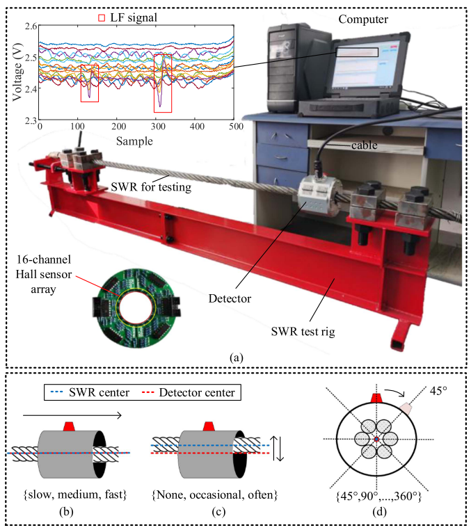
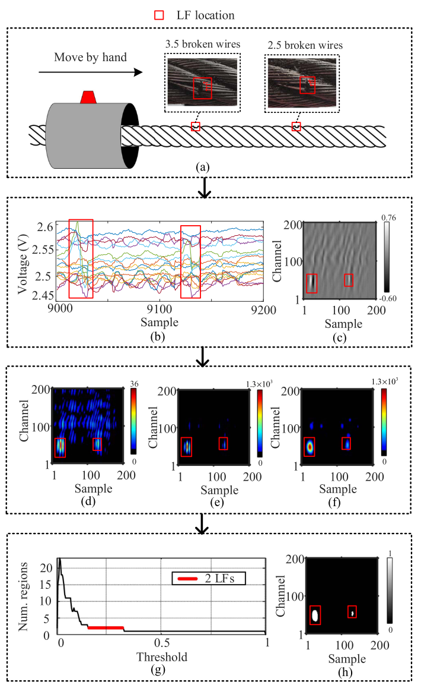
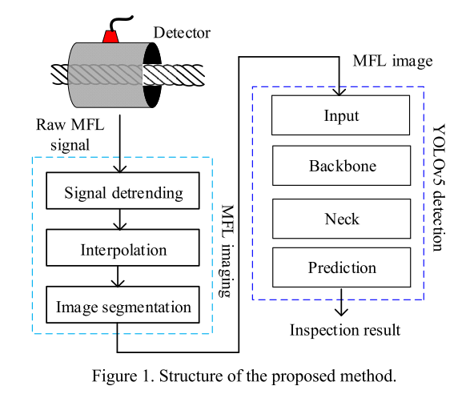
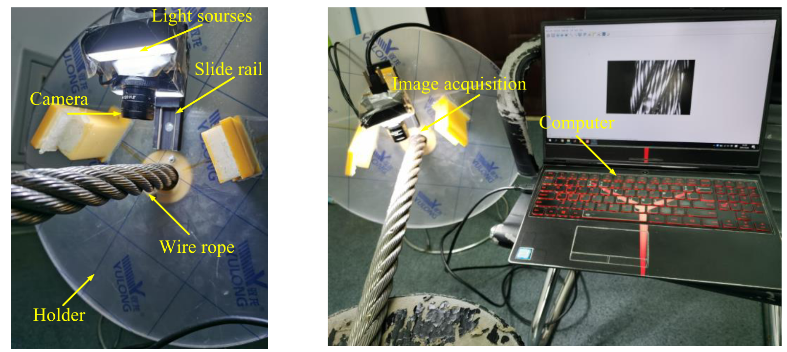

# Research Interets 

1. Signal/Image Processing and Artificial Intelligence 
   - Densoising method
   - Object Detection

2. Prognostics and health management (fault diagnosis, anomaly detection) : 
   - Intelligent Sensor Method
   - Ultrasound Method
   - Simulation and modeling

---

# Research Experiences 

## 1. 09/2020 ~ present, UESTC, Fault Diagnosis of Steel Wire Rope Based on Image Processing and Deep Learning

*Research Program at UESTC* 

 - *Supervisor*: [Prof. Zhiliang LIU](https://www.smee.uestc.edu.cn/info/1177/8351.htm "Prof. Zhiliang LIU's homepage"){:target="_blank"} 

 - *Program Introduction*:
    Steel wire ropes are important load-bearing components in many industrial cases. Flaws on steel wire ropes can threat the safety of the system. Magnetic flux leakage method is a promising non-destructive testing (NDT) method to detect flaws on steel wire ropes, but various kinds of noises severely influence the detection accuracy. There are two main part of this program:
   - Mechanism simulation and Hardware design: Design inspection equipment based on magnetic field simulation.
   - Algorithm: Develope new signal/image processing method or data driven method to increase the inspection performance.

### Publication 1. 
 - Pan, F., Liu, Z., Ren, L., & Zuo, M. (2023). Adaptive local flaw detection based on magnetic flux leakage images with a noise distortion effect for steel wire ropes. IEEE Transactions on Industrial Electronics. (Impact factor = 7.7).

 - In this study, the effect of noise distortion is analyzed and an image processing based method is proposed to solve this problem. 

    
    
     
    

        left: Inspection equipment; right: Case study
    

    
 

### Publication 2. 
 - Pan, F., Huang, Y., Ren, L., & Liu, Z. (2023, October). Inspection of Wire Ropes Based on Magnetic Flux Leakage Images by Using YOLOv5. In 2023 Global Reliability and Prognostics and Health Management Conference (PHM-Hangzhou) (pp. 1-7). IEEE.

 - In this study, the YOLOv5 network is applied to steel wire rope inspection. 

    
    
 

### Publication 3. 
 - Pan, F., Ren, L., Zhou, J., & Liu, Z. (2022, March). Fault classification based on computer vision for steel wire ropes. In Journal of Physics: Conference Series (Vol. 2184, No. 1, p. 012035). IOP Publishing.

 - In this study, optical image of steel wire rope is used. Feature descriptors are extracted to classify different types of faults. 

    
    
 

## 2. 09/2022 ~ present, USTC, Impact of Skull to Ultrasound Wave

 - *Supervisor*: [Prof. Chao TIAN](http://staff.ustc.edu.cn/~ctian/ "Prof. Chao TIAN's homepage"){:target="_blank"} 

 - *Program Introduction*:
   Skull is the major obstacle of the high-quality transcranial ultrasound imaging, as it makes the ultrasound wave being attenuated and phase-distorted. To handle this problem, simulation of the wave behaviour is first implemented to study the mechanism. Then, correction algorithm is designed to reduce the effect of skull.

---
